# CRM Inmobiliario — Manual de Usuario

> **Versión 1.0 · MVP Gates PASS 27-08-2026**
> **Producción:** `https://crm-inmobiliario-phi-two.vercel.app`
> **Proyecto Supabase:** `phvirucslmmnkrcebtas` · **Vercel Root:** `crm`
> **Tag vigente:** `v1.0-gates-pass` + fixes `a6af170` (10 MB) · `48ea161` (drawer) · `105a25e` (sidebar)
> **Idioma UI:** 100% español · **Moneda:** EUR · **Stack:** Next 16 + React 19 + Tailwind 4 + Supabase RLS/Storage/Auth + Resend
> **Audiencia:** agentes, administradores de agencia y super-admin (Maestro)

---

## Cómo usar este manual

- **Lee §4 si es tu primer día** (acceso por agencia + enlace mágico).
- **Agente diario:** §5 → §10.
- **Administrador:** + §11 y §13.
- **Super-admin:** + §12.
- Cada tarea trae **Objetivo · Tiempo · Prerrequisitos · Pasos con captura · Tip/Warning · Indicador de éxito** — prueba cada paso mientras lees.

> **Convenciones:** `Ruta` = URL dentro de la app · **Negrita** = botón/etiqueta exacta · `código` = valor a copiar · 💡 Tip · ⚠️ Advertencia · ✅ Éxito

---

## Índice

1. [Qué es y para quién](#1-qué-es-y-para-quién)
2. [Requisitos](#2-requisitos)
3. [Glosario rápido](#3-glosario-rápido)
4. [Acceso y primer inicio](#4-acceso-y-primer-inicio)
5. [Navegación (desktop y móvil)](#5-navegación-desktop-y-móvil)
6. [Dashboard — tu mañana en 30 segundos](#6-dashboard--tu-mañana-en-30-segundos)
7. [Propiedades — alta, ficha, galería y estados](#7-propiedades--alta-ficha-galería-y-estados)
8. [Contactos — listado, drawer y origen web](#8-contactos--listado-drawer-y-origen-web)
9. [Pipeline — de lead a cierre arrastrando](#9-pipeline--de-lead-a-cierre-arrastrando)
10. [Agenda — visitas sin choques](#10-agenda--visitas-sin-choques)
11. [Ajustes de agencia — branding, usuarios y captación](#11-ajustes-de-agencia--branding-usuarios-y-captación)
12. [Panel Maestro — solo super_admin](#12-panel-maestro--solo-super_admin)
13. [Formulario web público — el imán de leads](#13-formulario-web-público--el-imán-de-leads)
14. [Flujos paso a paso (6 tareas guiadas)](#14-flujos-paso-a-paso-6-tareas-guiadas)
15. [Roles y permisos — matriz](#15-roles-y-permisos--matriz)
16. [Atajos de teclado](#16-atajos-de-teclado)
17. [Buenas prácticas del día a día](#17-buenas-prácticas-del-día-a-día)
18. [Solución de problemas](#18-solución-de-problemas)
19. [FAQ](#19-faq)
20. [Soporte, backups y actualizaciones](#20-soporte-backups-y-actualizaciones)

---

## 1. Qué es y para quién

### Qué es

Un CRM **multi-agencia**: una sola instalación sirve a varias inmobiliarias; cada agencia ve **solo sus datos**. El aislamiento no es un filtro de la app, es **Row Level Security (RLS) en Postgres** + refuerzo en cada query (`agency_id = get_my_agency_id()`).

**Módulos (rutas reales):**

| Módulo | Ruta | Quién entra |
|---|---|---|
| Login con branding | `/login` (+ `?agencia=slug`) | Público |
| Formulario público | `/form/[slug]` (iframe) | Público |
| API pública de leads | `POST /api/public/leads/[slug]` | Público |
| Dashboard | `/dashboard` | Sesión |
| Propiedades | `/propiedades` · `/propiedades/[id]` · `/propiedades/nuevo` | Sesión |
| Contactos | `/contactos` | Sesión |
| Pipeline | `/pipeline` | Sesión |
| Agenda | `/agenda` | Sesión |
| Ajustes | `/ajustes?tab=branding\|usuarios\|captacion` | Admin agencia |
| Maestro | `/maestro` | Solo super_admin |


*Captura pendiente — guarda el PNG en `docs/screenshots/mapa-modulos.png`.*

### Para quién

| Perfil | Usa a diario | Debe leer |
|---|---|---|
| **Agente** | Propiedades, Contactos, Pipeline, Agenda | §5–10 + §14 |
| **Administrador de agencia** | + Ajustes (branding, usuarios, captación) | §5–11 + §14–15 |
| **Super-admin (Maestro)** | Alta/baja agencias, suplantación | §12 + todo |

---

## 2. Requisitos

| Requisito | Mínimo | Recomendado |
|---|---|---|
| Navegador | Chrome / Edge / Firefox / Safari actualizado | Última versión, con cookies y JS activos |
| Pantalla | 375 px (móvil) | 1440 px (desktop) |
| Cuenta | Email + (contraseña o enlace mágico) | Contraseña + enlace mágico como respaldo |
| Agencia | Estado **Activa** | — |
| Imágenes | JPG/PNG/WEBP/GIF/AVIF ≤5 MB c/u | Comprimir a <2 MB para carga instantánea |
| Lote de subida | ≤10 MB por envío (`serverActions.bodySizeLimit`) | 3–5 fotos por lote |
| Internet | Requerido | — |

> 💡 **Tip:** no instalas nada. Todo es web.

---

## 3. Glosario rápido

- **Slug:** identificador corto de la agencia en URLs (`fincas-mediterraneo`). Visible en `/maestro` bajo el nombre.
- **RLS:** capa de seguridad en base de datos que impide que A vea filas de B aunque adivine la URL.
- **Suplantar (impersonar):** el super-admin opera *como* una agencia; deja rastro en `impersonation_logs`.
- **Lead web:** contacto creado desde `/form/[slug]` con `origen=web` + `consent_rgpd`.
- **Pipeline:** tablero Kanban donde cada tarjeta es una **oferta** (contacto × propiedad × etapa).

---

## 4. Acceso y primer inicio

### Objetivo

Entrar a tu agencia por primera vez, con o sin contraseña, y dejar el acceso guardado.

**Tiempo:** 2–3 minutos · **Prerrequisitos:** conocer tu **slug** y tu **email** invitado.

### 4.1 Entrar por tu agencia (dos caminos)

#### Camino A — link directo (recomendado, 30 s)

**Paso 1 — Abre tu link.** Guarda en favoritos:

```
https://crm-inmobiliario-phi-two.vercel.app/login?agencia=TU-SLUG
```

*Ejemplo Fincas:* `.../login?agencia=fincas-mediterraneo`

**Paso 2 — Verifica tu marca.** Arriba del formulario verás **logo, nombre y color** de tu agencia. Si no aparecen, el slug es incorrecto.


*Login de Fincas con `agencia=fincas-mediterraneo` — logo y `#0ea5e9`.*

**Paso 3 — Credenciales.**

- Si ya tienes contraseña → escribe **email** + **contraseña** → **Entrar** → vas a `/dashboard`.
- Si eres invitado sin contraseña → deja la contraseña vacía y pulsa **Recibir enlace mágico por correo** (ver 4.2).

✅ **Éxito:** ves `/dashboard` con tus KPIs. La próxima vez el slug ya queda recordado.

#### Camino B — entrada genérica (si no tienes el link)

1. Ve a `.../login` sin `?agencia=`.
2. Te pide primero el **identificador de agencia** → escribe el slug → verás el branding.
3. Luego el formulario de credenciales.

> 💡 **Tip:** comparte siempre el **link con `?agencia=`** en el grupo de WhatsApp de la agencia — evita errores de slug.

### 4.2 Primer acceso sin contraseña (cuentas invitadas)

Las invitaciones crean la cuenta **confirmada pero sin contraseña** (no llega email automático).

**Paso 1 — Pide el enlace mágico.**

1. En el login de tu agencia, escribe tu **email**.
2. Pulsa **Recibir enlace mágico por correo**.

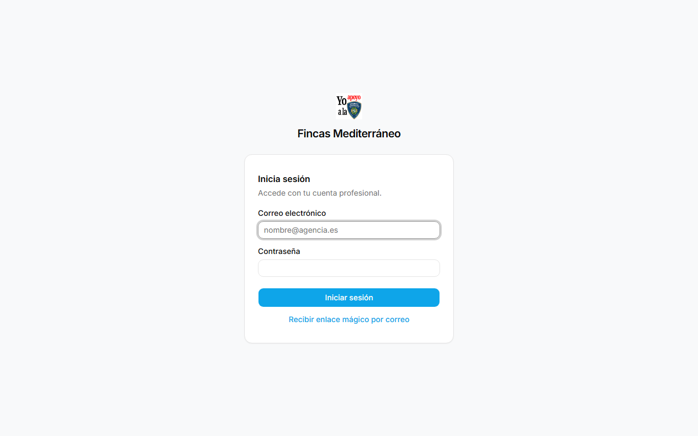

**Paso 2 — Abre el email.**

- Revisa **Inbox y Spam**. Remitente: el SMTP configurado en Supabase (por defecto `noreply@...`).
- Pulsa el botón/lin k → te lleva a `.../auth/callback` → entras directo a `/dashboard`.

**Paso 3 — Fija tu contraseña (recomendado).**

- En el login usa **¿Olvidaste tu contraseña?** → escribe email → recibirás el link para crearla.
- O el super-admin te la crea: **Authentication → Users → tu email → Send password recovery**.

> ⚠️ **Advertencia:** los enlaces mágicos son de **un solo uso** y caducan en **60 minutos**.

### 4.3 Recuperar / cambiar contraseña

1. En `/login` → **¿Olvidaste tu contraseña?**
2. Escribe tu email → **Enviar**.
3. Abre el email → **Restablecer** → escribe nueva contraseña (mín. 8, combina may/min/núm).

### 4.4 Mensajes de bloqueo (y qué hacer)

| Mensaje | Causa | Solución |
|---|---|---|
| `Esta agencia no está disponible o está desactivada` | Agencia **Desactivada** desde Maestro | Avisa al super-admin para **Reactivar** en `/maestro` |
| `No tienes ninguna agencia activa` | Eres **super_admin sin suplantar** e intentas crear/invitar | Ve a `/maestro` → **Suplantar** la agencia → verás el banner ámbar |
| `Enlace inválido o caducado` | Magic link ya usado o >60' | Pide otro en el login |
| `Credenciales inválidas` | Email o password mal | Verifica mayúsculas; la `Demo1234!` es case-sensitive |

---

## 5. Navegación (desktop y móvil)

### Objetivo

Moverte sin perderte entre módulos.

**Tiempo:** 1 minuto · **Prerrequisitos:** sesión iniciada.

### Desktop — sidebar izquierdo

- **Logo + nombre** arriba (tu agencia). **Colapsar** (flecha) deja solo iconos.
- Orden fijo: **Dashboard · Propiedades · Contactos · Pipeline · Agenda · Ajustes**.
- **Avatar arriba dcha.** → perfil / Cerrar sesión.
- **Activo** se ve con fondo `accent 0.92` + borde + `font-semibold` (fix `105a25e`).

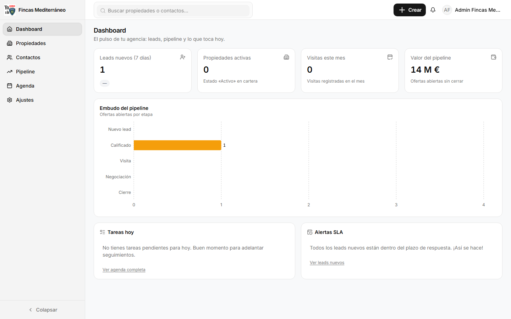
*Sidebar colapsado y expandido — el activo va con borde y negrita.*

### Móvil — bottom tab + FAB

- **Tab inferior** con 5 iconos + **FAB +** (crear propiedad/contacto). Mismo contenido, apilado.
- El drawer de contacto ocupa toda la pantalla (ver §8).

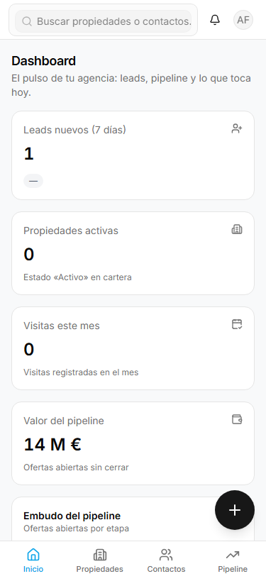

### Reglas de navegación

- La raíz `/` redirige a `/dashboard`.
- Mientras suplantas, verás el **banner ámbar** fijo `Estás viendo {Agencia} · Salir` en todo el shell (ver §12).
- `Esc` cierra cualquier diálogo/drawer; `Tab` navega campos.

---

## 6. Dashboard — tu mañana en 30 segundos

**Ruta:** `/dashboard` · **Objetivo:** ver de un vistazo qué atender hoy · **Tiempo:** 30 s

**Qué ves:**

- **KPIs:** propiedades activas, contactos nuevos (24h), ofertas por etapa, visitas de la semana, leads `web` sin atender > SLA.
- **Actividad reciente:** últimas altas/cambios con hora y autor.
- **Alertas SLA:** si un lead web supera las **horas** configuradas en Ajustes → Captación, aparece en ámbar/rojo.

**Pasos:**

1. Entra a `/dashboard` al abrir el día.
2. Si hay **alerta SLA**, pulsa la tarjeta → te lleva al contacto → atiéndelo (ver Flujo 4).
3. Revisa **Actividad** para no duplicar trabajo.

✅ **Éxito:** sabes qué 3 cosas hacer primero.


---

## 7. Propiedades — alta, ficha, galería y estados

**Ruta:** `/propiedades` · `/propiedades/nuevo` · `/propiedades/[id]` (ficha con 3 pestañas)

### 7.1 Listado — Objetivo: encontrar en <10 s

**Tiempo:** 1 min · **Prerrequisitos:** ninguna propiedad aún.

**Pasos:**

1. Abre `/propiedades`. Verás **tarjetas** con foto, referencia, precio EUR, ciudad y estado con color (verde publicado, ámbar reservado, rojo vendido).
2. Usa **filtros** arriba:
   - **Buscador** → escribe `REF-0001` o `Villa Cerro` o `Busot` (filtra por título/referencia/ciudad).
   - **Estado:** `borrador · publicado · reservado · vendido · retirado`.
   - **Operación:** `venta · alquiler` · **Tipo:** `piso · casa · villa...` · **Precio mín/máx** (number input, valida `priceMin ≤ priceMax`).
3. **Paginación:** 12 por página, orden estable `created_at DESC + id DESC` (no saltan tarjetas entre páginas).
4. Toggle **Mapa/Lista** si está activo.

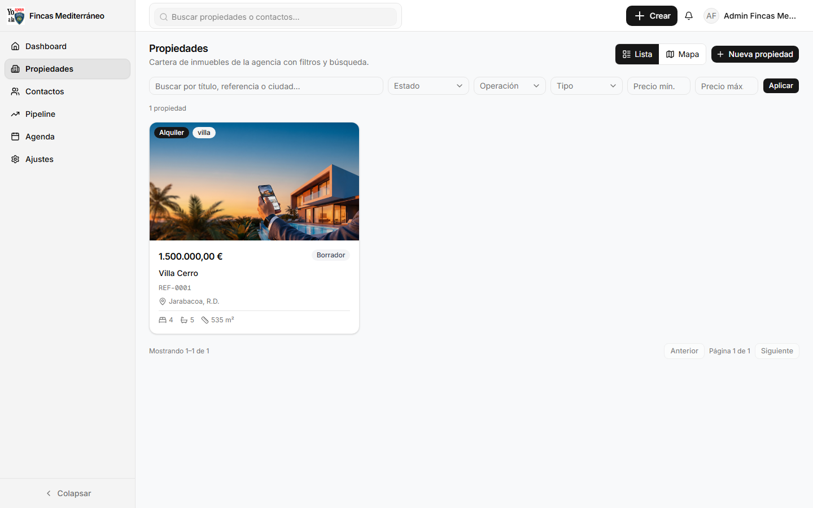

> 💡 **Tip:** guarda el link con filtros aplicados en favoritos — los filtros viven en la URL.

### 7.2 Crear propiedad — Objetivo: dar de alta sin errores

**Tiempo:** 3 min · **Prerrequisitos:** sesión con agencia activa (si ves `No tienes agencia activa`, ve a §12.2).

**Pasos:**

1. Pulsa **+ Nueva propiedad** (desktop) o **FAB +** → **Propiedad** (móvil).
2. Rellena **Datos** (los * son obligatorios — valida con `zod` en `crm/src/lib/validators/property.ts`):

   ```
   Título:       Villa Cerro - 3 hab con vistas
   Referencia:   REF-0001  (única por agencia)
   Ciudad:       Busot
   Dirección:    C/ Cerro 12
   Precio:       285000  (EUR, se formatea es-ES)
   Operación:    venta
   Tipo:         villa
   Habitaciones: 3   Baños: 2   Superficie: 140
   Descripción:  ...
   Estado:       borrador  (recomendado al crear)
   ```

3. Pulsa **Guardar** → vas a la **ficha** `/propiedades/[id]` en pestaña **Datos**.

✅ **Éxito:** ves el toast `Propiedad creada` y la ficha con tu referencia.

> ⚠️ **Advertencia:** la **Referencia** debe ser única por agencia; duplicada da `La referencia ya existe`.

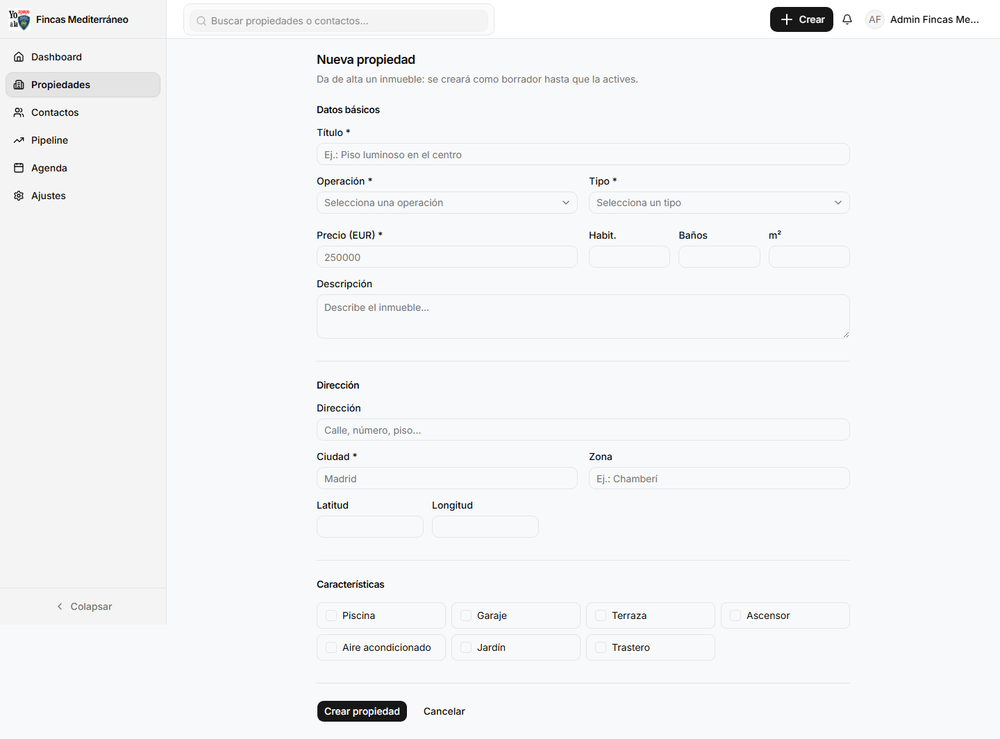

### 7.3 Ficha — 3 pestañas

| Pestaña | Contiene | Cuándo usar |
|---|---|---|
| **Datos** | Formulario editable + mapa + selector de estado + archivar | Editar precio, descripción, estado |
| **Galería** | Subir / reordenar / borrar fotos | Fotos reales de la vivienda |
| **Visitas** | Timeline de actividades + visitas asociadas | Ver historial y agendar |

#### Pestaña Datos — editar

1. Cambia cualquier campo → **Guardar**. Validación en cliente (zod) marca en rojo el campo con error (ej. `priceMin > priceMax`).
2. **Cambiar estado:** selector → `borrador → publicado → reservado → vendido`. Cada cambio deja auditoría `sistema` en **Visitas**.
3. **Retirado:** archiva — desaparece de `listPropertyOptions` (no se podrá usar en nuevas ofertas, pero mantiene historial).

#### Pestaña Galería — Objetivo: dejar fotos vendibles

**Tiempo:** 2 min · **Prerrequisitos:** ficha creada.

**Pasos:**

1. Entra en la ficha → pestaña **Galería** → botón **Subir fotos** (`aria-label="Subir imágenes"`).

   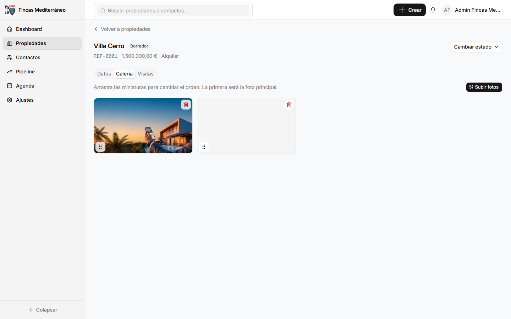

2. Selecciona 1–5 imágenes a la vez (o arrastra):
   - Formatos: **JPG, PNG, WEBP, GIF, AVIF**
   - Tamaño: **≤5 MB por imagen · lote ≤10 MB** (`MAX_IMAGE_BYTES` + `bodySizeLimit 10mb` fix `a6af170`)
   - Ruta Storage: `property-images/{agency_id}/{property_id}/`
3. Espera miniaturas. **Reordena** arrastrando — la primera es la **portada** del listado.
4. Borra con **papelera** → confirma en diálogo.

✅ **Éxito:** ves las miniaturas ordenadas; en el listado la portada ya aparece.

> ⚠️ **Si se queda en "subiendo…" sin fin:** el archivo supera el límite del navegador (antes 1 MB). Comprime a <5 MB o divide el lote.

#### Pestaña Visitas — Objetivo: trazabilidad

- Verás **cronología ascendente** (100 máx.) con: `sistema` (cambios de estado), `nota`, `visita` (fecha/hora).

---

## 8. Contactos — listado, drawer y origen web

**Ruta:** `/contactos` · **Objetivo:** no perder ningún lead

### 8.1 Listado

**Columnas:** `Contacto | Teléfono | Email | Estado | Origen | Presupuesto | Agente | Última actividad`

- **Estados:** `Nuevo → En seguimiento → Calificado → Descartado / Cerrado`
- **Origen:** `manual` (alta en CRM) · `web` (form público) — los `web` traen `consent_rgpd` + `consent_at`
- **Filtros:** estado, origen, buscador; paginado.

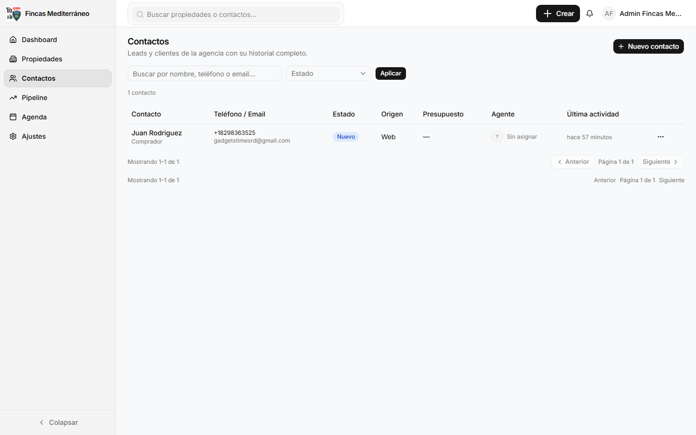

### 8.2 Crear contacto — Objetivo: alta en 60 s

**Tiempo:** 1 min

**Pasos:**

1. **+ Nuevo contacto** → rellena:

   ```
   Nombre:     Juan Rodriguez
   Teléfono:   +18298363525  (formato E.164 para wa.me)
   Email:      gadgetstimesrd@gmail.com
   Estado:     Nuevo
   Presupuesto:240000
   Notas:      Busca villa en Busot, 3 hab
   ```

2. **Guardar** → aparece en la tabla con `origen=manual`.

### 8.3 Drawer — la ficha que sí se usa

Pulsa cualquier fila → se abre el **drawer lateral** (360 px desktop, full móvil):

**Arriba — Acciones rápidas (siempre visibles, con borde):**

- **Oferta** → abre `DealCreateDialog` (elige propiedad `REF-...` no retirada → crea oferta en Pipeline).
- **WhatsApp** → abre `https://wa.me/{teléfono}` con el número del contacto.

**Centro — Perfil:** datos editables, origen, `consent_rgpd`, presupuesto, agente asignado.

**Abajo — Timeline:** notas, cambios de estado, visitas, ofertas.


*Fix 27-08 `48ea161`: antes la grilla de 3 columnas ocultaba Oferta abajo; ahora va apilada arriba con borde.*

**Pasos para crear oferta desde aquí (recomendado):**

1. Abre el contacto → **Oferta**.
2. Elige propiedad (busca `REF-0001`), importe, notas → **Crear**.
3. ✅ **Éxito:** toast `Oferta creada` + tarjeta en `/pipeline` columna `Nuevo lead` → `Juan Rodriguez → REF-0001`.

> 💡 **Tip:** guarda el teléfono en `+34`/`+1` con prefijo — el botón WhatsApp funciona directo sin copiar/pegar.

### 8.4 Contactos web y RGPD

- Vienen de `POST /api/public/leads/[slug]` o `.../form/[slug]` (ver §13).
- Se aíslan por agencia: un lead de `fincas-mediterraneo` nunca aparece en `demo` (verificado 27-08: `fincas 1/1/1` vs `demo 5` cross 0).

---

## 9. Pipeline — de lead a cierre arrastrando

**Ruta:** `/pipeline` · **Objetivo:** mover ofertas sin perder el hilo · **Tiempo:** 30 s por movimiento

**Columnas por defecto:**

`Nuevo lead → Contactado → Visita programada → Visita realizada → Oferta → Cierre` (renombrables en Ajustes).

**Pasos:**

1. **Crear tarjeta** (ver §8.3) → aparece en `Nuevo lead` como `Contacto → Referencia` (ej. `Juan Rodriguez → REF-0001 · Villa Cerro`).

   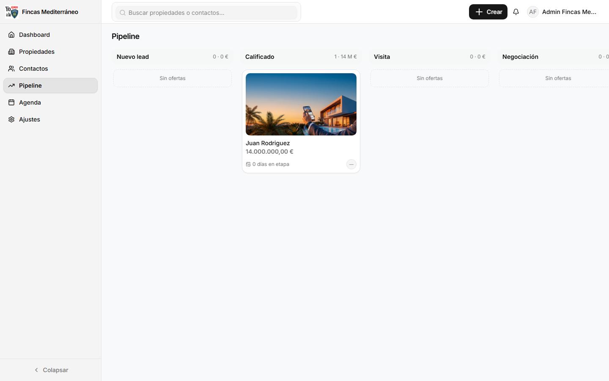

2. **Arrastra** la tarjeta entre columnas (drag & drop) → suelta → se guarda solo (verificado 27-08: arrastre fluido).
3. **Alternativa sin arrastrar:** abre la tarjeta → cambia **Etapa** → Guardar.
4. Pulsa la tarjeta para ver/editar importe, notas, propiedad y contacto vinculados.

✅ **Éxito:** la tarjeta queda en la nueva columna y la oferta cambia de `stage` en BD.

> 💡 **Tip:** usa el Pipeline como tu "siguiente acción": todo lo que está en `Visita programada` debe tener fecha en §10.

---

## 10. Agenda — visitas sin choques

**Ruta:** `/agenda` · **Objetivo:** agendar y no solapar

**Pasos:**

1. **Nueva visita** desde: ficha de propiedad → pestaña **Visitas** → **Agendar** · o desde contacto → **Agenda** · o botón global en `/agenda`.
2. Rellena: **Propiedad** (`REF-...`), **Contacto**, **Fecha**, **Hora**, **Agente**, **Notas**.
3. Guarda → aparece en la lista + en la timeline del contacto y de la propiedad.

**Filtros:** por fecha, agente y estado. Vista lista (próximas primero).

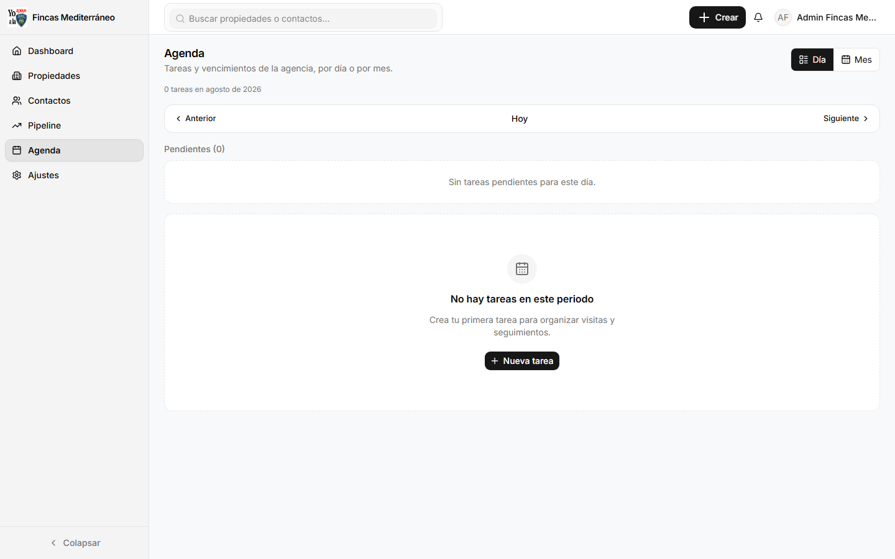

---

## 11. Ajustes de agencia — branding, usuarios y captación

**Ruta:** `/ajustes?tab=branding|usuarios|captacion` · Solo **Administrador** de agencia · **Tiempo:** 3 min por pestaña

### 11.1 Branding — Objetivo: que el CRM parezca tuyo

**Pasos:**

1. Ve a `/ajustes?tab=branding`.
2. Edita **Nombre**, **Logo (URL de imagen)** y **Color de marca** (ej. Fincas `#0ea5e9`) — verás **preview en vivo** del login y del sidebar.
3. **Guardar** → abre `.../login?agencia=tu-slug` en incógnito para verificar.

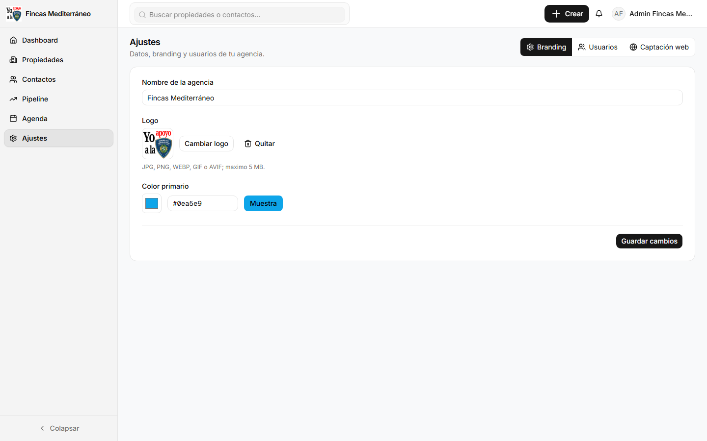

> ✅ **Éxito:** toast `Branding actualizado` + login con tu color.

### 11.2 Usuarios — Objetivo: invitar sin romper nada

**Pasos:**

1. `/ajustes?tab=usuarios` → **Invitar usuario**.
2. Rellena **Nombre**, **Email**, **Rol**: `Administrador` (puede invitar/branding/captación) o `Agente` (solo opera).

   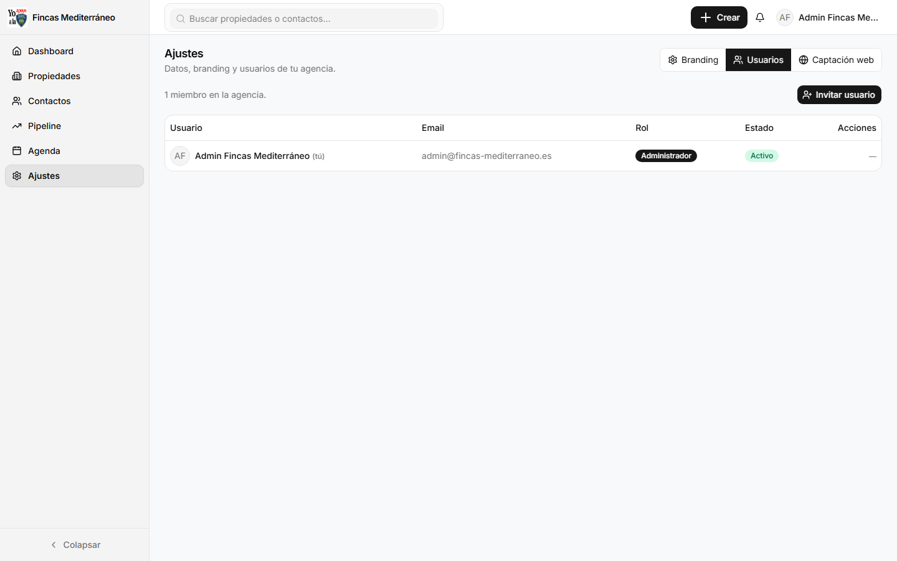

3. **Crear invitación** → la cuenta queda **confirmada sin contraseña**.
4. Dile al invitado que entre por `.../login?agencia=tu-slug` → **Recibir enlace mágico** (ver §4.2) o envíale **Recuperación** desde Supabase.

✅ **Éxito:** aparece en la tabla de usuarios con su rol.

> ⚠️ **No compartas contraseñas.** Cada persona usa su email + magic link o su propia contraseña.

### 11.3 Captación web — Objetivo: activar tu imán de leads

**Pasos:**

1. `/ajustes?tab=captacion` → activa **Formulario de contacto público**.
2. Configura:
   - **Mostrar email:** sí/no
   - **Mostrar mensaje:** sí/no
   - **Mensaje de gracias:** ej. `Gracias por contactar con Fincas Mediterráneo` (visible tras enviar).
3. Pulsa **Copiar código** → copia el iframe (ver §13.1) → pásalo a tu webmaster.

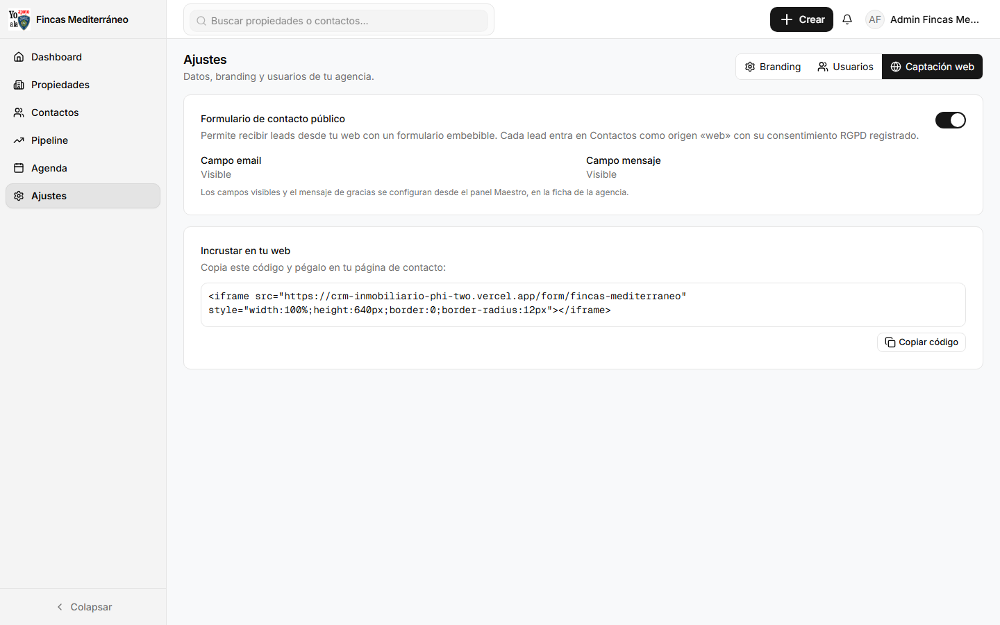

✅ **Éxito:** `GET /form/tu-slug` ya muestra tu formulario en lugar de `No disponible`.

---

## 12. Panel Maestro — solo super_admin

**Ruta:** `/maestro` · Rol `super_admin` (`agency_id=null`) · **Objetivo:** dar de alta agencias y operar por ellas

### 12.1 Crear agencia — Objetivo: alta en 2 minutos

**Tiempo:** 2 min · **Prerrequisitos:** sesión como super_admin.

**Pasos:**

1. Entra a `/maestro`.
2. Pulsa **+ Nueva agencia** → rellena:

   ```
   Nombre:  Fincas Mediterráneo
   Slug:    (vacío = auto: fincas-mediterraneo) o escribe fincas-mediterraneo
   Logo:    https://.../logo.png
   Color:   #0ea5e9
   SLA:     24 h
   Días por etapa: según pipeline
   Formulario web: activado + gracias personalizado
   ```

   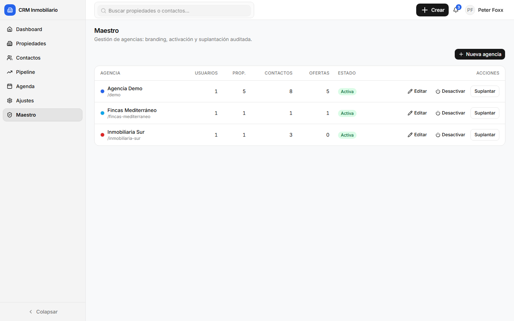

3. **Guardar** → aparece en la tabla con contadores a 0 y estado **Activa**.

✅ **Éxito:** la agencia ya existe; su login es `.../login?agencia=fincas-mediterraneo`.

### 12.2 Suplantar — Objetivo: operar como la agencia

**Pasos:**

1. En la tabla, fila de la agencia → **Suplantar**.
2. Verás el **banner ámbar fijo** en todo el shell: `Estás viendo Fincas Mediterráneo · Salir`.

   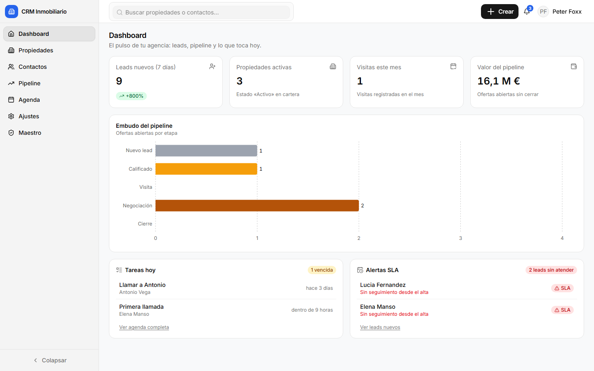

3. Ahora navega a `/propiedades`, `/ajustes?tab=usuarios`, etc. — creas como si fueras de esa agencia.
4. Al terminar, pulsa **Salir** en el banner → vuelves a `/maestro`.

> ⚠️ **Mientras suplantas, `/maestro` redirige a `/dashboard`.** Es intencional: evita operar Maestro sin salir del contexto.

✅ **Éxito:** auditoría en `impersonation_logs`:

```sql
select super_admin_id, target_agency_id, started_at, ended_at
from impersonation_logs order by started_at desc limit 10;
```

*Verificado 27-08: fincas `93cdd7c0…` 1 log abierto → `ended_at` sellado al salir.*

### 12.3 Desactivar / Reactivar — Objetivo: offboarding sin borrar

**Pasos:**

1. En `/maestro`, fila → **Desactivar** → confirma en diálogo.
2. Efectos inmediatos:
   - `GET /api/public/leads/{slug}` → `404 AGENCY_UNAVAILABLE` (verificado)
   - `GET /form/{slug}` → `No disponible`
   - `.../login?agencia={slug}` → `Esta agencia no está disponible`
3. Para reactivar → **Activar** en la misma fila.

---

## 13. Formulario web público — el imán de leads

**Objetivo:** captar desde tu web sin código complejo · **Tiempo:** 5 min (con webmaster)

### 13.1 Embed — Objetivo: pegarlo y que funcione

**Pasos:**

1. Asegúrate de que en `/ajustes?tab=captacion` el formulario está **Activado** (ver §11.3).
2. Copia el snippet (botón **Copiar código**):

```html
<iframe src="https://crm-inmobiliario-phi-two.vercel.app/form/fincas-mediterraneo"
  style="width:100%;height:640px;border:0;border-radius:12px"
  title="Contacto Fincas Mediterráneo"></iframe>
```

3. Pégalo en la web del cliente (página Contacto). Ajusta `height` si lo ves corto.

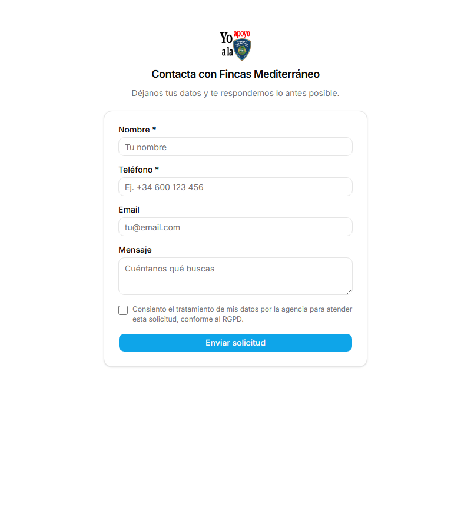

✅ **Éxito:** abres la web → ves el formulario con tu branding y el mensaje de gracias tras enviar.

**API directa (alternativa a iframe):**

```powershell
Invoke-RestMethod -Method Post `
  -Uri "https://crm-inmobiliario-phi-two.vercel.app/api/public/leads/fincas-mediterraneo" `
  -ContentType "application/json" `
  -Body '{"fullName":"Juan Rodriguez","phone":"+18298363525","email":"juan@example.com","message":"Busco villa 3 hab"}'
# → 201 Created (honeypot vacío → 200, slug falso → 404, rate-limit 429)
```

### 13.2 Qué pasa tras cada envío

- Crea/deduplica un **contacto** en **esa agencia** con `origen=web`, `consent_rgpd=true`, `consent_at` now.
- Aparece en `/contactos` en segundos.
- Si `RESEND_API_KEY` está configurado, avisa por email a los admins — es **best-effort** (si falla el email, el lead queda guardado igual).

### 13.3 Botón Admin en la web del cliente

```html
<a href="https://crm-inmobiliario-phi-two.vercel.app/login?agencia=fincas-mediterraneo">Admin</a>
```

Preselecciona la agencia y recuerda el slug para futuras visitas.

---

## 14. Flujos paso a paso (6 tareas guiadas)

> Cada flujo está probado en producción 27-08 con **Fincas Mediterráneo** (`93cdd7c0…`) + **Juan Rodriguez** (`9a343fcc…`) + **Villa Cerro REF-0001** (`92286ae5…`).

### Tarea 1 — Alta express de agencia (super_admin) · 3 min

**Objetivo:** dejar una agencia lista para operar.
**Prerrequisitos:** sesión `peterfoxx93@gmail.com` super_admin.

1. `/maestro` → **Nueva agencia** → `Fincas Mediterráneo` / `fincas-mediterraneo` / `#0ea5e9` → Guardar → ver fila Activa.
2. **Suplantar** Fincas → banner ámbar.
3. `/ajustes?tab=usuarios` → **Invitar** `admin@fincas-mediterraneo.es` (Administrador) → **Salir**.
4. El invitado entra por `.../login?agencia=fincas-mediterraneo` → **enlace mágico** → ya opera.
5. Verifica: `GET /api/public/leads/fincas-mediterraneo` → 201; `/form/fincas-mediterraneo` → 200.

✅ **Éxito:** `select slug, active from agencies where slug='fincas-mediterraneo'` → `active=true`.

### Tarea 2 — Tu primera propiedad con fotos · 5 min

**Objetivo:** publicar una vivienda con portada vendible.
**Prerrequisitos:** agencia activa.

1. `/propiedades/nuevo` → rellena (ver §7.2) → **Guardar** en `borrador`.
2. Ficha → **Galería** → **Subir fotos** → 3 fotos ≤5 MB → verifica portada.
3. **Datos** → estado `publicado` → Guardar.
4. Verifica en `/propiedades` que la portada se ve.

✅ **Éxito:** tarjeta con foto y `REF-0001` en el listado.

### Tarea 3 — Captar un lead desde la web · 4 min

**Objetivo:** que un visitante acabe en `/contactos`.
**Prerrequisitos:** captación activa (§11.3).

1. Abre `.../form/fincas-mediterraneo` en incógnito → rellena nombre + teléfono + consent → **Enviar** → ver mensaje de gracias.
2. Entra al CRM como tu agencia → `/contactos` → ver contacto `origen=web` con `consent_rgpd`.
3. (API) verifica con `Invoke-RestMethod POST /api/public/leads/fincas-mediterraneo` → 201.

✅ **Éxito:** contacto nuevo con `source=web`.

### Tarea 4 — De lead a oferta · 2 min

**Objetivo:** convertir interés en pipeline.
**Prerrequisitos:** contacto + propiedad publicada.

1. `/contactos` → abre el lead → **Oferta** → elige `REF-0001` → Crear.
2. `/pipeline` → ver tarjeta `Juan Rodriguez → REF-0001` en `Nuevo lead`.

✅ **Éxito:** `select count(*) from deals where agency_id='93cdd7c0…'` → 1.

### Tarea 5 — Visita y cierre · 3 min

**Objetivo:** cerrar el círculo.
**Prerrequisitos:** oferta creada.

1. Arrastra la tarjeta a **Visita programada**.
2. `/agenda` → **Nueva visita** → property `92286ae5…` + contact `9a343fcc…` + fecha/hora.
3. Tras la visita, mueve a **Visita realizada** → **Oferta** → **Cierre**.

✅ **Éxito:** la tarjeta está en `Cierre` y la timeline del contacto tiene la visita.

### Tarea 6 — Desactivar agencia (offboarding) · 1 min

**Objetivo:** cortar accesos sin borrar datos.
**Prerrequisitos:** super_admin.

1. `/maestro` → **Desactivar** → confirma.
2. Verifica: `POST /api/public/leads/fincas-mediterraneo` → `404 AGENCY_UNAVAILABLE`; `/form/...` → No disponible.

✅ **Éxito:** `select active from agencies where slug='fincas-mediterraneo'` → `false`.

---

## 15. Roles y permisos — matriz

| Acción | Agente | Admin agencia | Super-admin sin suplantar | Super-admin suplantando |
|---|:---:|:---:|:---:|:---:|
| Ver Dashboard/Propiedades/Contactos/Pipeline/Agenda | ✅ | ✅ | ✅ (agregado todas las agencias) | ✅ (solo suplantada) |
| Crear/editar propiedad, subir fotos | ✅ | ✅ | ❌ `No tienes agencia activa` | ✅ |
| Crear contacto/oferta/visita | ✅ | ✅ | ❌ | ✅ |
| Ajustes (branding/captación/usuarios) | ❌ | ✅ | ❌ | ✅ |
| Maestro (crear/suplantar/desactivar) | ❌ | ❌ | ✅ | — (redirige a /dashboard) |
| Form público / API leads | público si activo | público si activo | público si activo | público si activo |

> **Aislamiento probado 27-08:** `fincas → demo 0 · demo → fincas 0 · PRO-0001 por id cross 0 · Villa Cerro cross 0` (RLS + `eq(agency_id, get_my_agency_id())`).

---

## 16. Atajos de teclado

| Atajo | Dónde | Qué hace |
|---|---|---|
| `Tab` / `Shift+Tab` | Formularios | Avanza/retrocede entre campos |
| `Enter` | Diálogos | Confirma (Guardar/Crear) |
| `Esc` | Global | Cierra diálogo/drawer |
| `Ctrl/Cmd + F` | Listados | Foco en buscador |
| `Arrastrar` | Pipeline | Mueve tarjeta entre etapas |

---

## 17. Buenas prácticas del día a día

- **Referencias:** prefijo por agencia (`REF-`, `FM-`) + numeración correlativa; nunca reutilices.
- **Fotos:** 1ª = portada; ordena por luz/espacio; borra duplicadas.
- **Teléfonos:** guarda en E.164 `+34 6XX XXX XXX` — el botón **WhatsApp** abre `wa.me` directo.
- **Pipeline:** mueve **después** de la acción real y deja nota en timeline ("visita hecha, cliente duda financiación").
- **SLA:** revisa `/dashboard` a primera hora — todo `web` sin atender > 24h debe llamarse hoy.

---

## 18. Solución de problemas

| Síntoma | Causa | Solución |
|---|---|---|
| Build warn `middleware → proxy` | Aviso Next 16 | Inofensivo; migra con `npx @next/codemod@canary middleware-to-proxy` cuando toque |
| `No tienes ninguna agencia activa` | Super-admin sin suplantar | `/maestro` → **Suplantar** → banner ámbar |
| Subida queda en `subiendo…` | >5 MB o lote >10 MB | Comprime o sube en lotes de 2 (fix `a6af170` subió límite a 10 MB) |
| Magic link no llega | Spam o Site URL mal | Revisa Spam; verifica Supabase **Site URL** + **Redirect `/auth/callback`**; en prod usa SMTP propio |
| `Esta agencia no está disponible` | Agencia Desactivada | Pide **Reactivar** en `/maestro` |
| Lead sin email de aviso | Sin `RESEND_API_KEY` o dominio no verificado | El lead **sí se guarda**; configura Resend + `LEADS_EMAIL_FROM` |
| Migración falla en Storage | Permisos `storage.buckets` | Crea buckets `property-images` y `branding` públicos y aplica sección 7 de `0001_schema.sql` |
| Sidebar poco contraste | Tema claro | Fix `105a25e`: `globals.css --sidebar 0.968/0.92` + activo con borde — **Ctrl+Shift+R** |
| Oferta no aparece en Pipeline | Propiedad `retirado` | Cambia estado a `publicado`/`reservado` — `retirado` se excluye de `listPropertyOptions` |
| Drawer tapa el botón Oferta | Versión antigua | Fix `48ea161`: acciones arriba con borde — actualiza y recarga |

Si nada funciona: copia **slug + captura + hora** y pásalo al super-admin.

---

## 19. FAQ

**¿El enlace mágico es seguro?** Sí: un solo uso, caduca en 60', va al email titular.

**¿Puedo tener dos agencias con el mismo email?** No: `auth.users.email` es único; cada persona = una agencia (super-admin = ninguna).

**¿Cambio el branding después?** Sí: `/ajustes?tab=branding` → Guarda → el login ya muestra el nuevo.

**¿El form es RGPD válido?** Sí si activas el checkbox de consentimiento (literal editable). Cada lead guarda `consent_rgpd` + `consent_at`.

**¿Desactivar borra datos?** No: solo bloquea accesos y form; reactivar restaura.

**¿Veo propiedades de otra agencia por URL?** No: RLS + `agency_id` → 404. El super-admin sin suplantar ve agregado (auditoría); suplantando ve solo la agencia.

**¿Cuántas fotos por propiedad?** Sin límite duro, pero recomendamos 8–15; lotes de ≤10 MB.

**¿Dónde veo el slug?** En `/maestro` bajo el nombre de la agencia.

---

## 20. Soporte, backups y actualizaciones

- **Producción:** Supabase `phvirucslmmnkrcebtas` (región EU) · Vercel `crm-inmobiliario-phi-two` (Root `crm`) · Auth Site `https://crm-inmobiliario-phi-two.vercel.app` + Redirect `/auth/callback`.
- **Deploy:** push a `master` → Vercel auto-deploy (build 3–11 s). Variables: `NEXT_PUBLIC_SUPABASE_URL` · `NEXT_PUBLIC_SUPABASE_ANON_KEY` · `SUPABASE_SERVICE_ROLE_KEY` (secreta) · `NEXT_PUBLIC_APP_URL` · `RESEND_API_KEY` (opcional) · `LEADS_EMAIL_FROM`.
- **Backups:** PITR de Supabase (restaura a punto en el tiempo desde Dashboard → Backups). No hay dumps manuales en este proyecto.
- **Logs y monitor:** Vercel → Deployments → Logs (build/runtime); Supabase → Table Editor / SQL Editor para `impersonation_logs`, `properties`, `contacts`.
- **Tag cerrado:** `v1.0-gates-pass` (feba872) + `0a923e4` (OPERATIONS) + `a6af170`/`48ea161`/`105a25e`.
- **Docs de referencia:** `README.md` (runbook deploy), `OPERATIONS.md` (post-MVP), `crm/supabase/VERIFY.md` (§E2E), `.superpowers/sdd/task-19-report.md` §4 (evidencia E2E ×2).
- **Contacto soporte:** super-admin `peterfoxx93@gmail.com` (indica slug + captura + hora + URL). Para nueva agencia, sigue **Tarea 1** de §14.

> **Pendiente visual:** guarda PNG en `docs/screenshots/` con los nombres del manual (`login-branding.png`, `sidebar-desktop.png`, `properties-list.png`, `property-gallery-upload.png`, `contact-drawer.png`, `pipeline-kanban.png`, etc.). El manual ya los referencia — al añadirlos, se verán en GitHub/Vercel.

---

*Fin del manual — MVP 1.0 cerrado 27-08-2026. Próxima agencia: Tarea 1 (§14) + snippet §13.1.*
